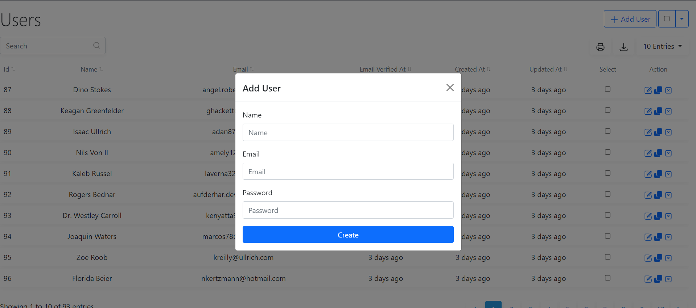
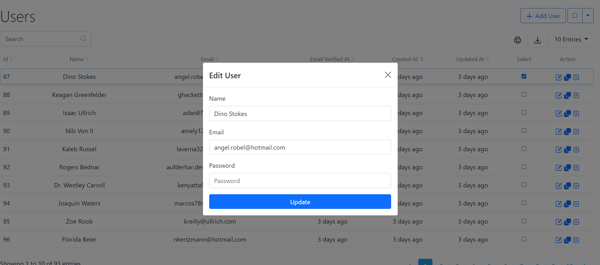
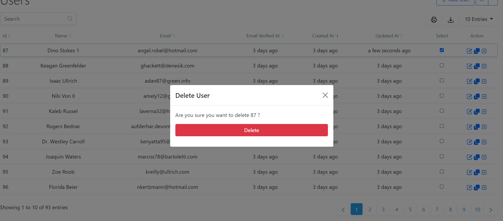

## datatable-cruds

[](https://www.paypal.com/paypalme/404Exist) [](https://packagist.org/packages/exist404/datatable-cruds) [](https://packagist.org/packages/exist404/datatable-cruds) [](https://github.com/404Exist/datatable-cruds/issues) [](https://packagist.org/packages/exist404/datatable-cruds)

[](https://packagist.org/packages/exist404/datatable-cruds)
## Installation
This package was created to deal with laravel datatables and cruds using vuejs.
Install the package through [Composer](http://getcomposer.org/). 

Run the Composer require command from the Terminal:

    composer require exist404/datatable-cruds
    

After completing the step above, use the following command to publish assets:

	php artisan vendor:publish --provider="Exist404\DatatableCruds\DatatableCrudsProvider"

Now you're ready to start using datatable cruds in your application.


## Overview
* [Demo](#demo)
* [General Methods](#general-methods)
* [Common Methods](#columns-and-inputs-common-methods)
* [Columns Methods](#columns-methods)
* [Inputs Methods](#inputs-methods)

## Demo
### web.php
```php
<?php

use App\Http\Controllers\DatatableExampleController;
use Illuminate\Support\Facades\Route;

/*
|--------------------------------------------------------------------------
| Web Routes
|--------------------------------------------------------------------------
|
| Here is where you can register web routes for your application. These
| routes are loaded by the RouteServiceProvider within a group which
| contains the "web" middleware group. Now create something great!
|
*/

Route::redirect('/', '/datatable-cruds-example');
Route::prefix('datatable-cruds-example')->name('datatable-cruds-example')->controller(DatatableExampleController::class)->group(function () {
    Route::get('/', 'index');
    Route::post('/', 'store')->name('.store');
    Route::patch('/{id}', 'update')->name('.update');
    Route::delete('/{id}', 'delete')->name('.delete');
});
``` 
### DatatableExampleController.php
```php
<?php
namespace App\Http\Controllers;

use App\Http\Controllers\Controller;
use App\Models\User;
use Exist404\DatatableCruds\Facades\DatatableCruds;

class DatatableExampleController extends Controller
{
    public function index()
    {
        return DatatableCruds::setModel(User::class)->fillColumns()->fillInputs()->render();
    }

    public function store(Request $request)
    {
        User::create($request->all());
        return [
            'toast-message' => 'New User Has Been Added Successfully.',
            'toast-type' => 'success',
        ];
    }

    public function update($id, Request $request)
    {
        User::where($request->findBy, $id)->first()->update($request->all());
        return [
            'toast-message' => 'User Has Been Updated Successfully.',
            'toast-type' => 'success',
        ];
    }

    public function delete($id, Request $request)
    {
        User::whereIn($request->findBy, explode(',', $id))->delete();
        return [
            'toast-message' => 'User Has Been Deleted Successfully.',
            'toast-type' => 'success',
        ];
    }
}
```
## General Methods
```php
$datatable = DatatableCruds::setModel(User::class);
```
### setModel()

Use the `setModel()` method at first it will define the model to get data from, it will specify the page title also by model table name.
```php
DatatableCruds::setModel(User::class);
```
### setTitle()

use it to set a custom title for the page.


```php
$datatable->setTitle("DataTables");
```
### setDir()

use it to set a custom direction for the page default is `"ltr"`.

```php
$datatable->setDir("rtl");
```
### setHeader()

use it to set a custom header with all requests, you can call it for every header you need to set.
the first parameter is for header name and the second one is for the header value.
**you can write javascript code in the second parameter**

```php
$datatable->setHeader('X-CUSTOM-HEADER', '`Bearer ${localStorage.getItem("token")}`');
```
### with()

when you need to call column or input from table relation you must use this method to get the relation data.
this method accepts `@mixed` parameters.

```php
$datatable->with('relation1', 'relation2:column1,column2', ...);
```
### searchBy()

use it to set the columns to search by. or you can just use `searchable()` method while rendering the column, we will explain it recently.
this method accepts `@mixed` parameters.

```php
$datatable->searchBy('id', 'name->en', ...);
```
### Routes
**by default you don't need to set any routes, the default routes will be as in the following table.**
| Route             | Method |
| ------------------| -------|
| CURRENT_URL       | GET    |
| CURRENT_URL       | POST   |
| CURRENT_URL/{id}  | PATCH  |
| CURRENT_URL/{id}  | DELETE |
### setGetRoute()
use it to set a custom route to get data from.
in the route controller method you can just return this helper function and pass your model to it `dataTableOf(User::class)`.

```php
$datatable->setGetRoute('/custom-route');
```
### setStoreRoute()
use it to set a route to send form store data to it. the first parameter is for the route and the second for the route method, by default its `POST`.

```php
$datatable->setStoreRoute('/store-route');
```
### setUpdateRoute()
use it to set a route to send form update data to it.
the first parameter is for the route , and the second for the route method, by default it's `PATCH`.
**route parameters must be written in curly brackets {} and these parameters will be replaced with the value from the row we are modifying**
Also with the request you will get a request key called `findBy` whose value in this case will be `id` and you can change the `findBy` request key name with this method `setRequestFindByKey("newFindByKey")`.

```php
$datatable->setUpdateRoute('/update-route'.'/{id}');
```
### setDeleteRoute()
use it to set a route to send form delete data to it.
the first parameter is for the route , and the second for the route method, by default it's `DELETE`.
**route parameters must be written in curly brackets {} and these parameters will be replaced with the value from the row we are deleting**
you will also get the request key `findBy` with the request as in the above example.

```php
$datatable->setDeleteRoute('/delete-route'.'/{id}');
```
### setDefaultDateFormat()

use it to set columns default date format. 
by default it's human format.

```php
$datatable->setDefaultDateFormat("YYYY-MM-DD");
```
### setDefaultOrder()

use it to set the default get data order.
by default its `("created_at", "desc")`.

```php
$datatable->setDefaultOrder("created_at", "desc");
```
### addAction() && editAction() && deleteAction() && cloneAction()

**all of these methods works in the same way.**
use it to set custom add button.
the first parameter of the method is button html,
the second one is button action you can set it to one of these choices `("openModal", "funcName", "href")` default is `"openModal"` 
and the third parameter is for action value if you set the button action to `"href"` you will need to pass href value in the third parameter 
and if you set the button action to `"funcName"` you will need to pass a javascript function name to execute onClick on the add button.
**by default add button will open modal for form store.**
if you send `funcName`, when you create this function in your app you will get two prameters in it `(event, row)` row which will contain the row data but in method `addAction()` you will only get the event `(event)`.

```php
$datatable->addAction('<button class="btn btn-primary"> Add New User </button>');
```
### search()

use it to set the search debounce time.
the first parameter of the method is the debounce time and the second one is for the class name of the search input, by default it is `"form-control"`.

```php
$datatable->search('500ms');
```
### setText()

use it to update any text.
the first parameter is for the text key and the second one is for its value.
you will find all available text keys at `config/datatablecruds.php`

```php
$datatable->setText("info", "Showing {from} to {to} of {total} entries");
```
### setLimits()

use it to set select limit entries options.
this method accepts `@mixed` parameters.
```php
$datatable->setLimits(10, 20, 30, 40, ...);
```
### formWidth()

use it to set custom width to form.

```php
$datatable->formWidth(40);
```
### storeButton()
use it to set custom label and color to form store button.
by default the label is `"Create"` and the color is `"primary"` 

```php
$datatable->storeButton("Create", "primary");
```
### updateButton()
use it to set custom label and color to form update button.
by default the label is `"Update"` and the color is `"primary"` 

```php
$datatable->updateButton("Update", "primary");
```
### deleteButton()
use it to set custom label and color to form delete button.
by default the label is `"Delete"` and the color is `"danger"` 

```php
$datatable->deleteButton("Delete", "danger");
```
### render()
Finally, use this method to render your datatable view.
this method accepts three prameters, the first for the blade `@extends` the second for the blade `@section`, and the third is an array of variables that can be accessed in the `@extends` blade file.
by default the first parameter is `"app"`, the second is `"content"` and the third is an empty array `[]`.

```php
$datatable->render("app", "content", ["title" => "datatable"]);
```
***

# Columns and Inputs Common Methods
### label()

You can use this method to set custom label for the column or input by default the label will be set from column or input name.
```php
$datatable->column("created_at")->label("Created Date")->date()->add();
$datatable->input("name")->label("User Name")->add();
```
### html()
you can use this method to set custom column or input html.
```php
$datatable->column("image")->html("Img: ")->add();
$datatable->input("hr")->html("<hr />")->add();
```
### attributes()

you can use this method to set custom html tag attributes to the column or the input.
```php
$datatable->updateColumn("id")->attributes([
    "class" => "btn btn-danger",
    "style" => "font-size: 20px"
]);
$datatable->updateInput("name")->attributes([
    "class" => "form-control",
    "style" => "font-size: 20px"
]);
```
### setAttribute()

you can use this method to set custom html tag attribute to the column or the input.
```php
$datatable->updateColumn("id")->setAttribute("class", "btn btn-danger")->setAttribute("style", "font-size: 20px");
$datatable->updateInput("name")->setAttribute("class", "form-control")->setAttribute("style", "font-size: 20px");
```
### sort()

sorting columns or inputs `sort("created_at", "updated_at")` this will display the `created_at` column first, then the `updated_at` column, and then the rest of the columns.
this method accepts `@mixed` parameters.
```php
$datatable->fillColumns()->sort("created_at", "updated_at");
$datatable->fillInputs()->sort("email", "name");
```
### except()

exclude certain columns or inputs from rendering `except("id")` this will not display the `id` column in the view.
this method accepts `@mixed` parameters.

```php
$datatable->fillColumns()->except("id", "email");
$datatable->fillInputs()->except("name");
```
### after()

you can use this method to move column or input after another.
```php
$datatable->updateColumn("id")->after("updated_at");
$datatable->updateInput("name")->after("email");
```
### before()

you can use this method to move column or input before another.
```php
$datatable->updateColumn("id")->before("updated_at");
$datatable->updateInput("name")->before("email");
```
### add()

you must use this method after creating the input or column.
```php
$datatable->column("html")->html("<p>Hello</p>")->add();
$datatable->input("name")->type("text")->after("email")->add();
```


# Columns Methods
### fillColumns() 

To fill datatable view with all Model columns without hidden columns and the casts as array and object columns.
```php
$datatable->fillColumns();
```
### column()

You can use this method to start creating a new column.
you can pass db_column_name or whatever name you need to the column method, if you pass the db_column_name it will return the data of that column, you can also access the nested data using `.` for example `column("name.en")`
**You Must Use `add()` method in the last of the `column()` method query**
```php
$datatable->column("updated_at")->sortable()->searchable()->date("YYYY-MM-DD")->add();
```
### updateColumn()

You can use this method to start updating a specific column.
```php
$datatable->updateColumn("updated_at")->sortable(false)->date();
```
### deleteColumn()

You can use this method to delete a specific column.
```php
$datatable->deleteColumn("updated_at");
```
### sortable()
You can use this method to make column is sortable.
this method accepts one boolean parameter by default it's true.

```php
$datatable->updateColumn("updated_at")->sortable(false);
```
### searchable()
You can use this method to make column is searchable.
this method accepts one boolean parameter by default it's true.

```php
$datatable->updateColumn("updated_at")->searchable(false);
```
### date()
You can use this method to make date columns more readable default is human format Optionally you can pass any format to date method or you can pass `false` to this method to remove any format from date.
```php
$datatable->column("date")->date("YYYY-MM-DD")->add();
```
### image()
You can use this method to show column in html img tag.
the image src will be the value of the db_column.
you can pass any value to this method and that value will be applied before the value of the db_column or you can pass `false` to this method to remove the image element.

```php
$datatable->column("image")->image("images/{id}/")->add();
```
### href()
**if you want to access any field value just write that field in curly brackets {} `{created_at}`**
you can use this method to set href to the column.
```php
$datatable->updateColumn("image")->href("{id}/{category.name.en}");
```
### actions()
You can use this method to create clone, edit and delete actions buttons, and you can optionally pass the given column label to the method the default label will be set from the column name.

```php
$datatable->column("actions")->actions()->add();
```
### checkall()
You can use this method to enable all rows to be selected for deletion at once, and you can optionally pass the given column label to the method the default label will be set from the column name.

```php
$datatable->column("select")->checkall()->add();
```
### exec()

you can use this method to execute any `javascript code`, by default it will return the whole code , if you want to return specfic data you will need to write `return` before it.
this method is used after `html()` or `href()` methods or you can pass `"html"` or `"href"` to the second parameter to add the return value from execution to it.
**in this method if field you are going to write in curly brackets {} is not number then you must enclose it in double quotes `"{created_at}"`**
```php
$datatable->updateColumn("custom_one")->html()->exec('{status} == 1 ? "<span class="badge bg-success"> Active </span>" : "<span class="badge bg-danger"> InActive </span>"');
```
****

# Inputs Methods
### fillInputs()

Fills forms with all fillable columns without casts as array and object columns. 
This method accepts two parameters, the first for the number of inputs to display per page, and the second for the input parent element class by default it's `"mb-3"`.

```php
$datatable->fillInputs();
```
### input()
You can use this method to start creating a new input.

```php
$datatable->input("name.en")->type("text")->add();
```
if you make input name like above example `"name.en"` then you can access it in store and update requests this way `$request->name->en`

**You Must Use `add()` method in the last of the `input()` method query**
### updateInput()

You can use this method to start updating a specific input.
```php
$datatable->updateInput("name.en")->form("edit");
```
### deleteInput()

You can use this method to delete a specific input.
```php
$datatable->deleteInput("name.en");
```
### form()

You can use this method to add the input in a specific form, by default it will be added in all forms. 
This method parameter can only be `"edit"` or `"add"`.
```php
$datatable->updateInput("name.en")->form("edit");
```
### page()

You can use this method to make the input added in the custom form page number.
```php
$datatable->updateInput("name.en")->page(1);
```
### parentClass()

You can use this method to add class to the parent element.
```php
$datatable->updateInput("name.en")->parentClass("col-md-3");
```
### labelClass()

You can use this method to add class to the label element.
```php
$datatable->updateInput("name.en")->labelClass("mb-1");
```
### type()

use this method to set the input type.
```php
$datatable->updateInput("name.en")->type("text");
```
### select()

you can use this method to make a `select` tag.
this method accepts two prameters the first one for options label column name by default its `name` and the second one is for options value column name by default its `id`.
```php
$datatable->input("select")->select("name.en")->options([
        ["id" => 1, "name" => ["en" => "datatable-1"]],
        ["id" => 2, "name" => ["en" => "datatable-2"]],
    ])->add();
```
### multiSelect()

you can use this method to make a `multi-select` input.
this method accepts three prameters the first one for options label column name by default its `name` , the second one is for options value column name by default its `id` and the last one is for multiple selection by default its `true`.
**in the edit form when multiSelect is multiple and you remove any selected options you will get the values of those options in the update request in request key starts with `remove_` then the input name.**
```php
$datatable->input("multi")->multiSelect("name.en")->options([
        ["id" => 1, "name" => ["en" => "datatable-1"]],
        ["id" => 2, "name" => ["en" => "datatable-2"]],
    ])->add();
```
if you want to get multiSelect options on search you can use `optionsRoute()` method. and you can use `$request->search` to access the search text.
```php
$datatable->input("multi")->multiSelect("name.en")->optionsRoute("/theRoute")->add();
```
### onChange()

you can use this method to update select options on other select change.
this method accepts two prameters the first one for the select name to update and the second one is for the route to get options from it.
you can use `$request->value` to access the selected option value in the onChange route.

```php
$datatable->input("select1")->select("name.en", "val")->options([
        ["val" => 1, "name" => ["en" => "datatable-1"]],
        ["val" => 2, "name" => ["en" => "datatable-2"]],
    ])
    ->onChange('select2', '/select2')->add();
$datatable->input("select2")->select("name.en");
```
### dropzone()

use this method to make drag and drop files input.
this method accepts dropzone attributes.
**in the edit form when dropzone is multiple and you delete any file from the dropzone you will get the values(ids) of those files in the update request in request key starts with `remove_` then the input name.**

```php
$datatable->input("image")->dropzone([
    // "idColumn" => "multiple_images.id", // the column name to set the values of the deleted images
    // "path" => "/images", // path to be set before the db image path
    "multiple" => true, // default is false
    "maxFiles" => 6,
    "maxFileSize" => 2 * 1024 * 1024, //2MB
    "acceptedFiles" => ['jpg ', 'mp4'],
    // "addDownloadinks" => true, // default is true
    // "addRemoveLinks" => true, // default is true
    // "addFileName" => true, // default is true
    // "addFileSize" => true, // default is true
    // "customeMaxFilesMsg" => 'You can\'t upload more than 6 files',
    // "customeMaxFileSizeMsg" => 'Sorry, but max file size must be 2MB',
    // "customeAcceptedFilesMsg" => 'Sorry, but allowed extensions are ',
    // "removeMessageAfter" => 5000, // time || false  default 2500 ms,
    // "notFoundFileCallBack" => "404.jpg",
    // "overLayMessage" => "Drop Here",
])->add();
```
### tags()

you can use this method to make a `tags` input.
```php
$datatable->updateInput("name.en")->tags();
```
### editor()

you can use this method to make a CkEditor, this method accepts one parameter which will be the default editor data.
```php
$datatable->input("editor")->editor("<h1>support me</h1>")->add();
```
### checkbox()

you can use this method to make a checkbox,
This method accepts two parameters. The first is the checked value of the checkbox which is `true` by default and the second is the unchecked value of the checkbox which is `false` by default.
```php
$datatable->input("checkbox")->checkbox(1, 0)->add();
```
### radio()

you can use this method to create radio buttons, this method accepts one parameter which will be the value of that radio button.
```php
$datatable->input("radio")->radio(1)->label("Choice 1")->add();
$datatable->input("radio")->radio(2)->label("Choice 2")->add();
$datatable->input("radio")->radio(3)->label("Choice 3")->add();
```
****
[](https://packagist.org/packages/exist404/datatable-cruds)
[](https://packagist.org/packages/exist404/datatable-cruds)
[](https://packagist.org/packages/exist404/datatable-cruds)
[](https://packagist.org/packages/exist404/datatable-cruds)
[](https://packagist.org/packages/exist404/datatable-cruds)
